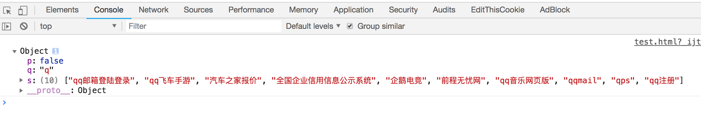
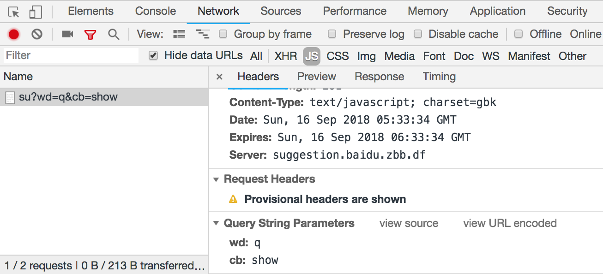
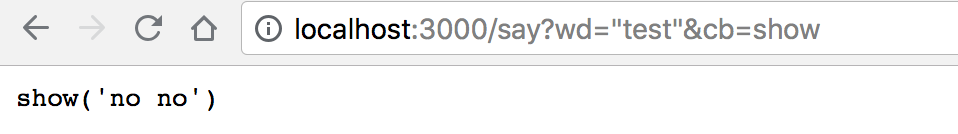
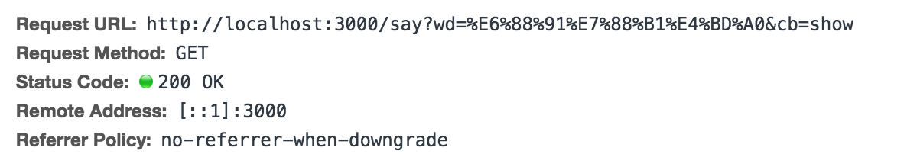

# jsonp
## 最简易应用与原理分析
```html
<!DOCTYPE html>
<html lang="en">
<head>
    <meta charset="UTF-8">
    <title>Title</title>
</head>
<body>
<script>
    function show(data){
    	console.log(data)
    }
</script>
<script src="https://sp0.baidu.com/5a1Fazu8AA54nxGko9WTAnF6hhy/su?wd=q&cb=show"></script>
</body>
</html>
```
result：

network请求：

跨域请求后cb返回
```javascript
show({q: "q", p: false, s:[]});
```
之后js中的`show`方法可以直接获取`cb`后`show`中的数据`{q: "q", p: false, s:[]}`，从而进行进一步数据处理

## jsonp 封装
```javascript
 function jsonp({url,params,cb}) {
      return new Promise((resolve,reject)=>{
      	// step 1: document.createElement('script');
        let script = document.createElement('script');
        //        处理callback数据，将cb后的参数定义为全局方法
        //          异步应用promise,resolve捕捉成功数据
        window[cb] = function (data) {
          resolve(data);
          // step 4 从cb接收到数据后，移除script
          document.body.removeChild(script);// 处理完移除
        }
        params = {...params,cb} // wd=b&cb=show
        let arrs = [];
        for(let key in params){
          arrs.push(`${key}=${params[key]}`);// 
        }
        // step2: 添加src
        script.src = `${url}?${arrs.join('&')}`;// 处理参数
        // script加入document
        document.body.appendChild(script);
      });
    }
```
应用以上jsonp方法本地模拟jsonp请求：
index.html：
```javascript
  jsonp({
      url: 'http://localhost:3000/say',
      params:{wd:'我爱你'},
      cb:'show'
    }).then(data=>{
      console.log(data);
    });
```
服务端：
```javascript
let express = require('express');
let app = express();

app.get('/say',function (req,res) {
  let {wd,cb} = req.query;
  res.end(`${cb}('nono')`)
})
app.listen(3000);
```
启动服务：
1）非跨域请求 `http://localhost:3000/say?wd=%22test%22&cb=show`
结果：

2） 用封装好的jsonp进行跨域请求，直接运行html文件，同样可实现请求，并将返回的结果打印输出:
```javascript
  window[cb] = function (data) {
          resolve(data);
          document.body.removeChild(script);
        }
```
此处将cb后参数返回响应的方法，并处理里面返回的数据


缺点：
> 1) 只能发送get请求 不支持post put delete
> 2) 不安全 xss攻击  不采用 ---> 返回脚本攻击本站

## document.domain: 
>  前提条件：这两个域名必须属于同一个基础域名!而且所用的协议，端口都要一致，否则无法利用document.domain进行跨域.
> Javascript出于对安全性的考虑，而禁止两个或者多个不同域的页面进行互相操作。
>  相同域的页面在相互操作的时候不会有任何问题
## 同源策略
协议 域名 端口 同域

http://www.zf.cn:8081
https://a.zf.cn:8081


## 为什么浏览器不支持跨域
cookie LocalStorage  
DOM元素也有同源策略 iframe
ajax 也不支持跨域

## 实现跨域
- jsonp 
- cors
- postMessage
- window.name
- location.hash
- http-proxy
- nginx
- websocket
- document.domain